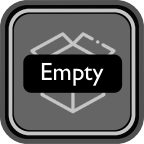
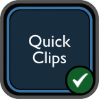
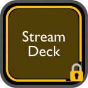
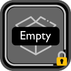

# Quick Clips

A Stream Deck plugin suite with two actions — **Quick Clips** for capturing and pasting clipboard content on demand, and **Quick Text Utils** for transforming text without leaving your workflow.

## Installation

### From the Stream Deck Marketplace (Pending Publication)

1. Open the Stream Deck application
2. Go to the Marketplace
3. Search for "Quick Clips"
4. Click Install

### Direct Download

1. Download `com.quickclips.streamdeck.streamDeckPlugin` from the [latest release](https://github.com/glmorgan/quick-clips/releases/latest)
2. Double-click to install

---

## Quick Clips

Turn Stream Deck buttons into flexible clipboard slots. Capture text once, paste it on demand, clear it when you're done — all without touching the Stream Deck UI.

### How It Works

1. Press an empty button to capture whatever text is on your clipboard
2. Press the same button again to paste it into the active application
3. Hold for one second to clear the slot when you're done

### Features

- **One-click capture and paste** — click empty to capture, click filled to paste
- **Simulate typing** — outputs text as keystrokes by default, leaving your clipboard untouched
- **Hold to clear** — press and hold one second to clear a slot
- **Prevent Clear mode** — lock a slot to protect it from accidental clearing
- **Persistent storage** — stored clips survive app restarts and profile switches

### Button States

| Empty | Filled | Locked (Filled) | Locked (Empty) |
|:-------:|:--------:|:----------------:|:-----------------:|
|  |  |  |  |
| Ready to capture | Stored, ready to paste | Protected, ready to paste | Protected, ready to capture |

### Button Settings

- **Paste Mode** — Simulate Typing (default) or Clipboard Paste
- **Prevent Clear** — disable hold-to-clear to protect a slot
- **Clear Stored Content** — manually reset the slot

---

## Quick Text Utils

Transform clipboard text without breaking your workflow. Copy text, press a configured button, and the transformed result is output directly — no apps to open, no menus to navigate.

Each button is dedicated to a single transform. Hold for one second to reconfigure it at any time.

### Transforms

**Case**
- To Upper, To Lower, To Title, To Camel, To Snake, To Dash

**Encode / Decode**
- B64 Encode, B64 Decode, URL Encode, URL Decode

**Utility**
- Trim — removes leading and trailing whitespace
- Count — displays word, character, and line counts

### How It Works

1. Copy text to your clipboard
2. Press a configured Quick Text Utils button
3. Transformed text is output (simulate typing by default)

To configure a button: hold for one second until the orange icon appears, release, then pick a transform from the list.

### Button Settings

- **Paste Mode** — Simulate Typing (default) or Clipboard Paste
- **Transform** — select a transform from the dropdown

---

## Platform Support

- **macOS** — Supported (macOS 12+)
- **Windows** — Planned for a future release

## Development

```bash
npm install          # Install dependencies
npm run build        # Build plugin
npm run watch        # Build + watch, auto-restarts plugin on save
npm test             # Run tests
npx streamdeck dev   # Enable developer mode (required once per machine)
```

Logs: `com.quickclips.streamdeck.sdPlugin/logs/com.quickclips.streamdeck.0.log`

## Technical Details

- Built with TypeScript using the Elgato Stream Deck SDK v2.0
- Uses native macOS clipboard tools (`pbpaste`, `pbcopy`, `osascript`)
- Text output via simulated keystrokes by default — clipboard is not overwritten on paste
- Settings stored persistently within Stream Deck profiles
- No external services or network access required

## License

MIT

## Author

Glen Morgan

## Support

For bugs, feature requests, or questions: https://github.com/glmorgan/quick-clips/issues
