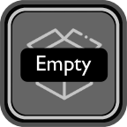
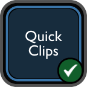
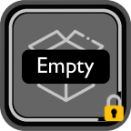

# Quick Clips

A Stream Deck plugin suite with three actions — **Quick Clips** for capturing and pasting clipboard content on demand, **Quick Text Utils** for transforming text without leaving your workflow, and **Quick Clips Manager** for keeping a named collection of snippets behind a single key.

## Installation

### From the Stream Deck Marketplace (Pending Publication)

1. Open the Stream Deck application
2. Go to the Marketplace
3. Search for "Quick Clips"
4. Click Install

### Direct Download

1. Download `com.quickclips.streamdeck.streamDeckPlugin` from the [latest release](https://github.com/glmorgan/quick-clips/releases/latest)
2. Double-click to install

---

## Paste Mode

All three actions share one setting, and it is worth understanding before the rest.

| Mode | What it does |
|:--|:--|
| **Automatic** (default) | Types single-line text as keystrokes. Sends anything containing newlines or tabs through the clipboard instead, then puts your clipboard back. |
| **Simulate Typing** | Always types, leaving your clipboard untouched. |
| **Clipboard Paste** | Always pastes, and leaves the text on your clipboard. |

**Why Automatic exists.** Simulated typing is indistinguishable from a human at the keyboard, so the receiving app treats it that way — Return triggers auto-indent, Tab moves focus or fires completion, and editors auto-close brackets. Paste a formatted JSON object by typing and it arrives with its indentation compounded. Pasting is a single insertion event, so none of that fires.

**Why typing is still worth having.** Some fields reject paste outright — password managers, certain web forms, terminals with paste protection — and typing is what gets text into those.

Existing buttons keep whatever mode they already had. Change it per button in the Property Inspector.

---

## Quick Clips

Turn Stream Deck buttons into flexible clipboard slots. Capture text once, paste it on demand, clear it when you're done — all without touching the Stream Deck UI.

### How It Works

1. Press an empty button to capture whatever text is on your clipboard
2. Press the same button again to paste it into the active application
3. Hold for one second to clear the slot when you're done

### Features

- **One-click capture and paste** — click empty to capture, click filled to paste
- **Hold to clear** — press and hold one second to clear a slot
- **Prevent Clear mode** — lock a slot to protect it from accidental clearing
- **Persistent storage** — stored clips survive app restarts and profile switches

### Button States

| Empty | Filled | Locked (Filled) | Locked (Empty) |
|:-------:|:--------:|:----------------:|:-----------------:|
|  |  |  |  |
| Ready to capture | Stored, ready to paste | Protected, ready to paste | Protected, ready to capture |

### Button Settings

- **Paste Mode** — Automatic (default), Simulate Typing, or Clipboard Paste
- **Prevent Clear** — disable hold-to-clear to protect a slot
- **Clear Stored Content** — manually reset the slot

---

## Quick Clips Manager

One key, a whole collection. Where a Quick Clip holds a single value, this holds many behind one button and opens a searchable window to choose between them.

It suits the long tail of per-project details — connection strings, client IDs, test accounts, ticket prefixes — that clutter a general clipboard history and are hard to find again. One button per project or per type. Values you paste constantly still belong on their own Quick Clip key.

### How It Works

1. **Press** the button to open the collection
2. **Type** to filter, then press Return to paste the top match — or ⌘1–9 to take any of the first nine
3. **Hold** the button for one second to file whatever is on your clipboard without opening anything

### Features

- **Add from clipboard** — a row at the top of the window captures whatever is currently copied
- **Hold to capture** — file a clip straight from the key, no window, for when you have just copied something
- **Name your clips** — give a clip a label like "Staging DB" so you can find it by name instead of by its contents
- **Edit in place** — the pencil expands a row so you can change both the name and the text
- **Hide a value** — mask a clip so it shows as dots. This is **shoulder-surfing protection, not encryption**: the value is stored as plain text and pastes normally
- **Credentials are masked as you capture them** — see below
- **Type badges** — rows are labelled JSON, URL, Path, Email, UUID, JWT, IP, Date or Text automatically, and a hex colour shows as its own colour
- **Filter by anything** — name, contents, or type. Typing "json" finds your JSON clips; "colour" or "hex" finds swatches
- **Undo a delete** — deleting is one click, so a toast offers to put it back for 8 seconds, via the button or ⌘Z. It returns to the position it came from
- **Stable order** — using a clip never moves it, so a clip's position and its ⌘-number stay put
- **50 clips per collection**, 10,000 characters each

### Masking credentials

When you capture something that looks like a credential, it is stored masked and given a name —
"GitHub token", "Authorization header", "URL with password" — and a **SECRET** badge. A toast
tells you why. The name matters: a masked clip is searchable by its name rather than its
contents, so without one it would be a row of dots you could not find again.

Recognised without guessing: tokens whose format the vendor publishes (GitHub, GitLab, Stripe,
Slack, AWS, Google, Anthropic, npm, SendGrid), private key blocks, JWTs, URLs carrying a
password, `Authorization` and `Bearer` headers, Basic credentials, and assignments to fields
named like `api_key` or `PASSWORD`. Anything else that is long, unbroken and random-looking is
masked too, but the toast says to check it — that one is a guess.

Stripe **publishable** keys are deliberately never masked; they are meant to be public.

**Two things this is not.** It is not encryption — a masked value is still plain text in your
Stream Deck profile, and it pastes normally. And it is not a guarantee: a short password, or an
internal token with no distinctive format, will not be recognised. Treat "not masked" as "nothing
matched", not as "checked and safe". Unmask anything in one click with the eye icon, and mask
anything it missed the same way.

Clips stored before this existed are not re-examined — re-capture one to have it masked.

### Window Reference

| Key | Action |
|:--|:--|
| Type | Filter by name, contents, or type |
| ↑ ↓ ← → | Move between clips |
| Return | Paste the selected clip |
| ⌘1 – ⌘9 | Paste one of the first nine visible clips — hold ⌘ to see the numbers |
| F2 | Edit the selected clip's name and text |
| ⌘Z | Undo the last delete |
| Escape | Close without pasting |

Inside the editor, ⌘Return saves and Escape cancels.

The window stays open when you switch away, so you can go and copy something, come back, and add it — several times over if you like. It closes when you paste, press Escape, or leave it untouched for three minutes.

### Button Settings

- **Collection Name** — shown on the key and as the window's heading
- **Paste Mode** — Automatic (default), Simulate Typing, or Clipboard Paste
- **Clear All Clips** — remove every clip in the collection

---

## Quick Text Utils

Transform clipboard text without breaking your workflow. Copy text, press a configured button, and the transformed result is output directly — no apps to open, no menus to navigate.

Each button is dedicated to a single transform. Hold for one second to reconfigure it at any time.

### Transforms

**Case**
- To Upper, To Lower, To Title, To Camel, To Snake, To Dash

**Encode / Decode**
- B64 Encode, B64 Decode, URL Encode, URL Decode

**Generate** — these ignore the clipboard and produce their own output
- Date — today's local date, `YYYY-MM-DD`
- Date & Time — local date and time, `YYYY-MM-DDTHH:mm:ss`
- Unix Time (s) — whole seconds since the epoch
- Unix Time (ms) — milliseconds, matching JavaScript and most JSON APIs
- UUID — a fresh random identifier

Dates are always your **local** calendar date, never UTC.

**Utility**
- Trim — removes leading and trailing whitespace
- Count — displays word, character, and line counts

### How It Works

1. Copy text to your clipboard
2. Press a configured Quick Text Utils button
3. The transformed text is output

To configure a button: hold for one second until the configure icon appears, release, then pick a transform from the window. Type to filter it, or use the arrow keys.

### Button Settings

- **Paste Mode** — Automatic (default), Simulate Typing, or Clipboard Paste
- **Transform** — select a transform from the dropdown

---

## Platform Support

- **macOS** — Supported (macOS 12+)
- **Windows** — Planned for a future release

The selection windows use a small bundled native helper. If it is unavailable, the plugin falls back to a Chromium-family browser window, and Quick Text Utils falls back again to a plain system dialog.

## Development

```bash
npm install          # Install dependencies
npm run build        # Build plugin
npm run build:native # Build the native window helper (needs Xcode Command Line Tools)
npm run watch        # Build + watch, auto-restarts plugin on save
npm test             # Run tests
npm run release      # Full gated release build
npx streamdeck dev   # Enable developer mode (required once per machine)
```

Logs: `com.quickclips.streamdeck.sdPlugin/logs/com.quickclips.streamdeck.0.log`

## Technical Details

- Built with TypeScript using the Elgato Stream Deck SDK v2.0
- Uses native macOS clipboard tools (`pbpaste`, `pbcopy`, `osascript`)
- Unicode text is delivered exactly, including emoji and non-Latin scripts
- Settings stored persistently within Stream Deck profiles
- Selection windows are served on a random loopback port, gated by a per-invocation token
- No external services or network access required

## License

MIT

## Author

Glen Morgan

## Support

For bugs, feature requests, or questions: https://github.com/glmorgan/quick-clips/issues
